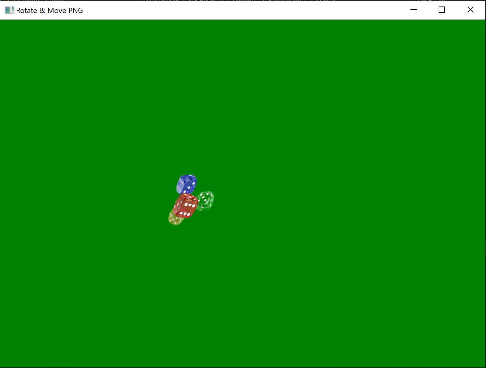
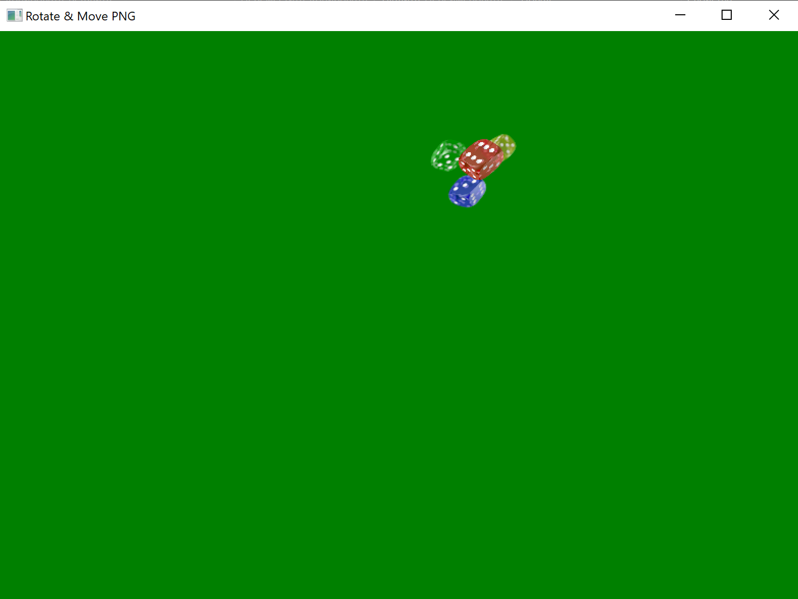

# Rotate & Move PNG


## Описание

Программа на C++ с использованием Win32 API и GDI+, которая позволяет:

- Загружать PNG-изображение.
- Перемещать его по окну с помощью клавиш стрелок или W/A/S/D.
- Вращать изображение на фиксированный угол клавишами Q/E.
- Сброс позиции и угла с помощью клавиши R.
- Управлять положением центра с помощью колеса мыши.
- Закрытие программы с сочетанием Ctrl + Z.

Программа демонстрирует использование **двойной буферизации**, чтобы избежать мерцания при движении и вращении изображения.

---

## Управление

| Действие                   | Клавиша                        |
| -------------------------- | ------------------------------ |
| Создать изображение        | C                              |
| Вверх/Вниз/Влево/Вправо    | W/S/A/D или стрелки            |
| Поворот по часовой стрелке | E                              |
| Поворот против часовой     | Q                              |
| Сброс позиции и угла       | R                              |
| Закрыть программу          | Ctrl + Z                       |
| Скролл мыши                | Перемещение центра изображения |

---

## Скриншоты

  


---

## Сборка

1. Клонировать репозиторий:
   ```bash
   git clone https://github.com/username/repo-name.git
   ```
